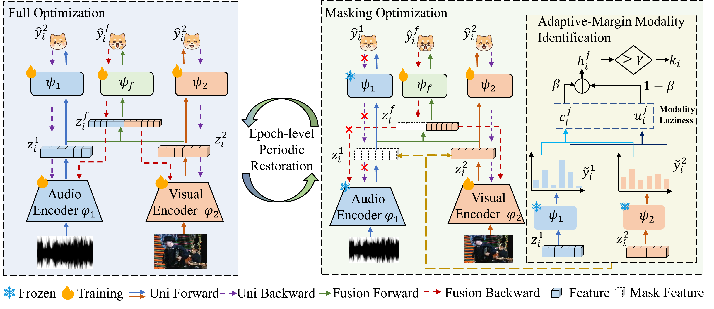

# Adaptive-Margin Masking and Restoration for Balanced Multimodal Learning (AMRe)

<div align="center">
[](https://nips.cc/)[](https://www.python.org/)[](https://pytorch.org/)[](LICENSE)
</div>
*Official PyTorch implementation of the **NeurIPS 2026 (Poster)** paper:*  
**"Adaptive-Margin Masking and Restoration for Balanced Multimodal Learning"**

---

## 📢 News
- **[2026-10]** 🎉 Our paper has been accepted by **NeurIPS 2026 (Poster)**!
- **[2026-10]** 🚀 Code, reproduction scripts, and hyperparameter recipes across audio-visual, visual-text, tri-modal, and MLLM benchmarks are released.

---

## 📌 Overview

Multimodal learning seeks to harness complementary signals from heterogeneous sensory streams. However, in practice, joint multimodal networks often suffer from **modality laziness**, where one dominant modality converges rapidly and dominates the optimization trajectory, thereby suppressing the representation learning and contribution of other subordinate (lazy) modalities.

<p align="center">
  
  <br>
  <em>Figure: The overall architecture and workflow of AMRe. <b>(Left) Full Optimization (Restoration)</b>: All modalities are jointly optimized to recover unimodal expressiveness and maintain representation stability. <b>(Right) Masking Optimization</b>: The Adaptive-Margin Modality Identification module assesses laziness via incorrectness and uncertainty, selectively masking the dominated modality to force lazy modality optimization.</em>
</p>

###  Pitfalls in Existing Paradigms
Existing remedies (such as gradient modulation or alternating optimization) face two fundamental limitations:
1. **Incomplete and Overly-Sharp Identification**: Relying on a single metric (e.g., loss alone or uncertainty alone) frequently misclassifies modalities with low error but high uncertainty (or vice versa). Furthermore, hard decision boundaries introduce severe optimization noise for ambiguous samples situated near the threshold.
2. **Lagging of Dominated Modality (Feature Degradation)**: Continuous suppression or prolonged skipping of dominant modalities blocks their gradient updates, ultimately causing feature degradation and undermining the joint representation.

---

## 📊 Benchmark Results

### 1. Superiority over SOTA Methods across Diverse Benchmarks
Evaluated across audio-visual (**CREMA-D**, **AVE**), visual-text (**MVSA-Single**), and tri-modal audio-visual-text (**IEMOCAP**) benchmarks:

| Method | Type | CREMA-D | AVE | MVSA | IEMOCAP | Average Acc |
| :--- | :---: | :---: | :---: | :---: | :---: | :---: |
| **Concat Baseline** | Conventional | 73.52% | 72.89% | 73.18% | 65.38% | 71.24% |
| **OGM-GE** (CVPR'22) | Joint Opt | 73.45% | 72.64% | 74.22% | 65.79% | 71.52% |
| **LFM** (NeurIPS'24) | Joint Opt | 77.28% | 72.39% | 73.31% | 66.42% | 72.52% |
| **OPM** (TPAMI'24) | Joint Opt | 78.76% | 74.38% | 73.39% | 65.83% | 72.99% |
| **MLA** (CVPR'24) | Alternating | 76.48% | 75.62% | 75.26% | 67.01% | 73.59% |
| **Resample** (CVPR'24) | Alternating | 75.00% | 71.89% | 74.43% | 66.57% | 71.98% |
| **Remix** (arXiv'25) | Alternating | 74.52% | 72.69% | 74.01% | 67.16% | 72.10% |
| **AMST** (ECML-PKDD'25)| Alternating | 80.50% | 74.38% | 72.60% | 68.40% | 73.97% |
| **AMRe (Ours)** | **Adaptive Masking** | **81.18%** | **76.37%** | **75.68%** | **68.93%** | **75.54% (+4.30%)** |

> **Note on Efficiency**: AMRe introduces less than **1.5% additional training latency** over vanilla Concat on a single NVIDIA V100 GPU (e.g., +0.21s/epoch on CREMA-D, +0.31s/epoch on IEMOCAP), achieving SOTA accuracy with near-zero computational overhead.

### 2. Generalization to Multimodal Large Language Models (MLLMs / Ola-7B)
AMRe seamlessly integrates into modern MLLMs (Ola-7B), consistently boosting multimodal understanding:
- **AVE**: Multimodal accuracy jumps from **90.55%** $\rightarrow$ **91.79%**, with lazy visual branch improving by **+5.88%** (64.68% $\rightarrow$ 70.56%).
- **MVSA**: Multimodal accuracy rises from **74.43%** $\rightarrow$ **75.68%**, with lazy text branch improving by **+3.95%** (66.11% $\rightarrow$ 70.06%).

---

## 📂 Repository Structure

```text
├── dataset/               # Dataset loaders and multi-modal pre-processing logic
│   ├── dataloader.py      # Audio-visual data loading routines
│   ├── Mydataset.py       # Custom datasets for CREMA-D, AVE, MVSA, IEMOCAP
│   ├── RemixDataset.py    # Baseline dataset wrapper for Remix
│   └── ResampleDataset.py # Baseline dataset wrapper for Resample
├── data/data_process/     # Pre-processing scripts for all four benchmarks
├── model/                 # Network modules
│   ├── AME.py             # Adaptive-Margin Evaluator (Incorrectness + Uncertainty + Soft Margin)
│   ├── basic_model.py     # Unimodal encoders (ResNet-18, BERT, MAE/ViT)
│   ├── fusion_model.py    # Fusion architectures (Concat, Sum, Gate, FiLM, CA, MMTM, CentralNet)
│   └── ola_encoder.py     # MLLM (Ola-7B) backbone adapter
├── scripts/               # Reproducible one-click bash scripts
│   ├── AVE/ave_base.sh
│   ├── CREMED/cremed_base.sh
│   ├── IEMOCAP3/IEMOCAP3_base.sh
│   ├── MVSA/MVSA_base.sh
│   ├── baseline/          # Benchmark scripts for MLA, Remix, Resample, AMST
│   └── Ola.sh             # MLLM adaptation script
├── train_all.py           # Standard training pipeline
├── train_all_OLA.py       # Training pipeline with Ola-7B
├── requirements.txt       # Environment dependencies
└── results-AMRe-concat.log# Experiment logs and checkpoint records
```

---

## 🛠️ Environment Setup

```bash
# 1. Clone repository
git clone https://github.com/LangNexus-Group/AMRe.git
cd AMRe

# 2. Create conda environment
conda create -n AMRe python=3.10 -y
conda activate AMRe

# 3. Install dependencies
pip install -r requirements.txt
```

---

## 💾 Dataset Preparation

All datasets used in this work are publicly available:
- **CREMA-D**: Audio-visual speech emotion dataset (7,442 clips across 6 emotion classes). Follow `data/data_process/CREMA-D/proData.ipynb`.
- **AVE**: Audio-visual event localization (4,143 video clips across 28 categories). Refer to `data/data_process/AVE/AVE_Dataset/ReadMe.txt`.
- **MVSA-Single**: Multi-view Twitter sentiment analysis (4,510 image-text pairs). Refer to `data/data_process/MVSA/`.
- **IEMOCAP**: Tri-modal conversational emotion dataset (Audio + Video + Text transcriptions across 5 classes). Refer to `data/data_process/IEMOCAP/`.

---

## 🚀 Reproduction & Quick Start

Execute the one-click bash scripts corresponding to each dataset:

```bash
# CREMA-D (Audio + Visual)
bash scripts/CREMED/cremed_base.sh

# AVE (Audio + Visual)
bash scripts/AVE/ave_base.sh

# MVSA (Image + Text)
bash scripts/MVSA/MVSA_base.sh

# IEMOCAP (Text + Visual + Audio, Tri-modal)
bash scripts/IEMOCAP3/IEMOCAP3_base.sh

# Multimodal LLM (Ola-7B)
bash scripts/Ola.sh

# Compare with baselines
bash scripts/baseline/MLA.sh
bash scripts/baseline/Remix.sh
bash scripts/baseline/Resample.sh
bash scripts/baseline/amst_full.sh
```

---

## 📜 Citation

```bibtex
@inproceedings{zhang2026amre,
  title     = {Adaptive-Margin Masking and Restoration for Balanced Multimodal Learning},
  author    = {Zhang, Guangbin and Luo, Zeyang and Liu, Jiangming},
  booktitle = {Advances in Neural Information Processing Systems (NeurIPS)},
  year      = {2026}
}
```

---

## 📄 License
This project is licensed under the [MIT License](LICENSE).
